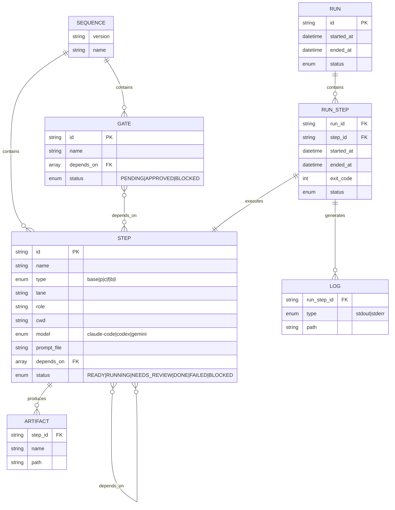

# feat: ThreadOS MVP - Thread-Based Engineering Runtime

## Overview

ThreadOS is a local-first, Windows-first "Thread Runtime" that enables engineers and LLM orchestrators to create, run, and manage Thread-Based Engineering workloads with strong auditability and safety controls.

This plan covers the **M0-M2 milestones** (foundation, runtime, and runner) to establish a working MVP before building the full UI and chat orchestrator.

## Problem Statement / Motivation

Agentic engineering is difficult to scale because teams lack:
1. A consistent **unit of work** ("thread") with an explicit lifecycle
2. A repeatable way to **scale compute** (parallelism, fusion) without UI chaos
3. A control plane that an **LLM orchestrator** can reliably manipulate

ThreadOS solves this by layering a **sequence model, deterministic controls, and auditability** on top of mprocs.

## Proposed Solution

Build ThreadOS in phases:
- **Phase 1**: Core infrastructure (sequence engine, seqctl CLI, mprocs adapter)
- **Phase 2**: Horizontal Sequence UI with React Flow
- **Phase 3**: Chat Orchestrator with SAFE mode

This plan covers **Phase 1** only.

## Technical Approach

### Architecture

```
+------------------+     +------------------+     +------------------+
|   seqctl CLI     |---->| Sequence Engine  |---->| .threados/       |
| (LLM-addressable)|     | (DAG validation) |     | sequence.yaml    |
+------------------+     +------------------+     +------------------+
                                  |
                                  v
+------------------+     +------------------+     +------------------+
| Runner Wrapper   |<----| Runtime          |---->| mprocs           |
| (logs, artifacts)|     | Controller       |     | (--server/--ctl) |
+------------------+     +------------------+     +------------------+
```

### Tech Stack
- **Runtime**: Bun + TypeScript
- **UI**: Next.js 16 + shadcn/ui + React Flow
- **Process Runner**: mprocs (vendored binary)
- **Data**: YAML (sequence.yaml), JSON (status files)

## Implementation Phases

### Phase 1: Foundation (M0-M2)

#### M0: Repository Scaffolding
- [ ] Create `.threados/` directory structure
- [ ] Define `sequence.yaml` JSON schema with Zod
- [ ] Create `seqctl init` command
- [ ] Add mprocs binary to `vendor/mprocs/windows/`

#### M1: mprocs Runtime Controller
- [ ] Create `MprocsClient` class for `--server`/`--ctl` commands
- [ ] Implement process lifecycle management (start, stop, restart)
- [ ] Add process-to-step ID mapping in `.threados/state/mprocs-map.json`
- [ ] Handle mprocs server startup and health checks

#### M2: Runner Wrappers + Artifacts
- [ ] Create standardized runner script (PowerShell/Bun)
- [ ] Implement artifact collection:
  - `runs/<runId>/<stepId>/stdout.log`
  - `runs/<runId>/<stepId>/stderr.log`
  - `runs/<runId>/<stepId>/status.json`
- [ ] Add prompt file management in `.threados/prompts/`

### Phase 2: Thread Templates (M3) - Future
- [ ] Base Thread template
- [ ] P-Thread (parallel) template with fanout
- [ ] C-Thread (chained) template with gates
- [ ] F-Thread (fusion) template
- [ ] B-Thread (orchestrated) template
- [ ] L-Thread (long autonomy) template

### Phase 3: Horizontal UI (M4) - Future
- [ ] React Flow canvas with custom step nodes
- [ ] Resizable panel layout (canvas + inspector + chat)
- [ ] Step card component with status chips
- [ ] Gate node for C-thread checkpoints
- [ ] Dependency connector visualization

### Phase 4: Chat Orchestrator (M5) - Future
- [ ] Natural language intent parsing
- [ ] Structured action generation
- [ ] Diff preview component
- [ ] SAFE mode approval flow
- [ ] Audit log integration

## Acceptance Criteria

### M0: Scaffolding
- [ ] Running `seqctl init` creates `.threados/` with valid `sequence.yaml`
- [ ] Schema validates step fields: id, name, type, model, prompt_file, depends_on, status
- [ ] mprocs.exe is accessible via `THREADOS_MPROCS_PATH` or vendored path

### M1: Runtime Controller
- [ ] Can start mprocs with server enabled (`--server 127.0.0.1:4050`)
- [ ] Can send commands via `mprocs --ctl '{c: start-proc}'`
- [ ] Process status updates reflected in `.threados/state/`

### M2: Runner + Artifacts
- [ ] Running a step creates `runs/<runId>/<stepId>/` directory
- [ ] stdout/stderr captured to log files
- [ ] status.json contains: startTime, endTime, exitCode, status

## Success Metrics

- seqctl CLI responds to all documented commands with JSON output
- mprocs processes can be controlled programmatically
- Artifacts are persisted and queryable after thread completion
- No data loss on ThreadOS restart

## Dependencies & Risks

### Dependencies
- mprocs binary (v0.7.2) for Windows - provided
- Bun runtime for CLI execution
- YAML library for sequence parsing

### Risks
| Risk | Impact | Mitigation |
|------|--------|------------|
| mprocs crashes | High | Implement health checks, auto-restart |
| Process hangs | High | Add configurable timeouts per step |
| File system race conditions | Medium | Use atomic writes, file locking |
| Windows path issues | Medium | Normalize paths on read/write |

## File Structure

```
C:\Users\albak\Threader\
|-- .threados/
|   |-- sequence.yaml           # Sequence definition
|   |-- prompts/                 # Step prompt files
|   |   |-- <stepId>.md
|   |-- runs/                    # Run artifacts
|   |   |-- <runId>/
|   |       |-- <stepId>/
|   |           |-- stdout.log
|   |           |-- stderr.log
|   |           |-- status.json
|   |-- state/                   # Runtime state
|   |   |-- mprocs-map.json     # Process-to-step mapping
|   |-- audit.log               # Append-only audit trail
|-- lib/
|   |-- errors.ts               # Custom error types (ThreadOSError, etc.)
|   |-- fs/
|   |   |-- atomic.ts           # Atomic file operations
|   |-- sequence/               # Sequence engine
|   |   |-- schema.ts           # Zod schemas (with Schema suffix)
|   |   |-- parser.ts           # YAML read/write with validation
|   |   |-- dag.ts              # DAG validation + topological sort
|   |   |-- frontier.ts         # Runnable frontier computation
|   |-- mprocs/                 # mprocs adapter
|   |   |-- client.ts           # MprocsClient with typed commands
|   |   |-- config.ts           # mprocs.yaml generation
|   |-- runner/                 # Runner wrappers
|   |   |-- wrapper.ts          # Standardized runner
|   |   |-- artifacts.ts        # Artifact collection
|   |-- seqctl/                 # CLI implementation
|       |-- index.ts            # Entry point with proper error handling
|       |-- commands/           # Subcommands
|           |-- init.ts
|           |-- step.ts
|           |-- run.ts
|           |-- status.ts
|-- vendor/
|   |-- mprocs/
|       |-- windows/
|           |-- mprocs.exe
```

## MVP Code Examples

### lib/sequence/schema.ts

```typescript
import { z } from 'zod'

// Schema naming convention: use Schema suffix to avoid name collision with types

export const StepStatusSchema = z.enum([
  'READY', 'RUNNING', 'NEEDS_REVIEW', 'DONE', 'FAILED', 'BLOCKED'
])
export type StepStatus = z.infer<typeof StepStatusSchema>

export const StepTypeSchema = z.enum(['base', 'p', 'c', 'f', 'b', 'l'])
export type StepType = z.infer<typeof StepTypeSchema>

export const ModelTypeSchema = z.enum(['claude-code', 'codex', 'gemini'])
export type ModelType = z.infer<typeof ModelTypeSchema>

export const StepSchema = z.object({
  id: z.string()
    .regex(/^[a-z0-9-]+$/, 'Step ID must contain only lowercase letters, numbers, and hyphens')
    .min(1, 'Step ID cannot be empty')
    .max(64, 'Step ID cannot exceed 64 characters'),
  name: z.string().min(1, 'Step name is required'),
  type: StepTypeSchema,
  lane: z.string().optional(),
  role: z.string().optional(),
  cwd: z.string().optional(),
  model: ModelTypeSchema,
  prompt_file: z.string().min(1, 'Prompt file path is required'),
  depends_on: z.array(z.string()).default([]),
  status: StepStatusSchema.default('READY'),
  artifacts: z.array(z.string()).optional(),
})

export const GateStatusSchema = z.enum(['PENDING', 'APPROVED', 'BLOCKED'])
export type GateStatus = z.infer<typeof GateStatusSchema>

export const GateSchema = z.object({
  id: z.string()
    .regex(/^[a-z0-9-]+$/, 'Gate ID must contain only lowercase letters, numbers, and hyphens')
    .min(1, 'Gate ID cannot be empty'),
  name: z.string().min(1, 'Gate name is required'),
  depends_on: z.array(z.string()),
  status: GateStatusSchema.default('PENDING'),
})

export const SequenceSchema = z.object({
  version: z.string().default('1.0'),
  name: z.string().min(1, 'Sequence name is required'),
  steps: z.array(StepSchema).default([]),
  gates: z.array(GateSchema).default([]),
})

// Clean type exports (no collision with schema names)
export type Step = z.infer<typeof StepSchema>
export type Gate = z.infer<typeof GateSchema>
export type Sequence = z.infer<typeof SequenceSchema>
```

### lib/mprocs/client.ts

```typescript
import { $ } from 'bun'
import { join } from 'path'
import YAML from 'yaml'

// Discriminated union for type-safe mprocs commands
type MprocsCommand =
  | { c: 'quit' }
  | { c: 'start-proc' }
  | { c: 'term-proc' }
  | { c: 'kill-proc' }
  | { c: 'restart-proc' }
  | { c: 'select-proc'; index: number }
  | { c: 'send-key'; key: string }
  | { c: 'add-proc'; name: string; cmd: string[] }
  | { c: 'remove-proc'; id: string }
  | { c: 'batch'; cmds: MprocsCommand[] }

// Result type for command execution
interface MprocsResult {
  success: boolean
  exitCode: number
  stderr?: string
}

export class MprocsClient {
  private serverAddress: string
  private mprocsPath: string

  constructor(
    serverAddress = '127.0.0.1:4050',
    mprocsPath = process.env.THREADOS_MPROCS_PATH ||
      join(process.cwd(), 'vendor/mprocs/windows/mprocs.exe')
  ) {
    this.serverAddress = serverAddress
    this.mprocsPath = mprocsPath
  }

  async sendCommand(command: MprocsCommand): Promise<MprocsResult> {
    // Use proper YAML library instead of hand-rolled serialization
    const yaml = YAML.stringify(command, { flowLevel: 0 }).trim()

    try {
      const result = await $`${this.mprocsPath} --ctl ${yaml}`.quiet()
      return {
        success: result.exitCode === 0,
        exitCode: result.exitCode,
      }
    } catch (error) {
      // Bun's $ throws on non-zero exit by default
      if (error instanceof Error && 'exitCode' in error) {
        const shellError = error as { exitCode: number; stderr: Buffer }
        return {
          success: false,
          exitCode: shellError.exitCode,
          stderr: shellError.stderr?.toString(),
        }
      }
      throw error // Re-throw unexpected errors
    }
  }

  async startProcess(index?: number): Promise<MprocsResult> {
    if (index !== undefined) {
      await this.sendCommand({ c: 'select-proc', index })
    }
    return this.sendCommand({ c: 'start-proc' })
  }

  async stopProcess(index?: number): Promise<MprocsResult> {
    if (index !== undefined) {
      await this.sendCommand({ c: 'select-proc', index })
    }
    return this.sendCommand({ c: 'term-proc' })
  }

  async restartProcess(index?: number): Promise<MprocsResult> {
    if (index !== undefined) {
      await this.sendCommand({ c: 'select-proc', index })
    }
    return this.sendCommand({ c: 'restart-proc' })
  }

  async addProcess(name: string, cmd: string[]): Promise<MprocsResult> {
    return this.sendCommand({ c: 'add-proc', name, cmd })
  }

  async batch(commands: MprocsCommand[]): Promise<MprocsResult> {
    return this.sendCommand({ c: 'batch', cmds: commands })
  }

  // Health check - verify mprocs server is running
  async isServerRunning(): Promise<boolean> {
    try {
      const result = await this.sendCommand({ c: 'select-proc', index: 0 })
      return result.success
    } catch {
      return false
    }
  }

  // Wait for server to become available
  async waitForServer(timeoutMs = 5000): Promise<boolean> {
    const start = Date.now()
    while (Date.now() - start < timeoutMs) {
      if (await this.isServerRunning()) {
        return true
      }
      await Bun.sleep(100)
    }
    return false
  }
}
```

### lib/seqctl/index.ts

```typescript
#!/usr/bin/env bun
import { parseArgs } from 'util'
import { z } from 'zod'
import { initCommand } from './commands/init'
import { stepCommand } from './commands/step'
import { runCommand } from './commands/run'
import { statusCommand } from './commands/status'

// Explicit CLI options interface
interface CLIOptions {
  json: boolean
  help: boolean
  watch: boolean
}

// Command handler type
type CommandHandler = (
  subcommand: string | undefined,
  args: string[],
  options: CLIOptions
) => Promise<void>

const commands: Record<string, CommandHandler> = {
  init: initCommand,
  step: stepCommand,
  run: runCommand,
  status: statusCommand,
}

// Error formatting utility
function formatError(error: unknown): string {
  if (error instanceof z.ZodError) {
    return error.errors.map(e => `${e.path.join('.')}: ${e.message}`).join(', ')
  }
  if (error instanceof Error) {
    return error.message
  }
  return String(error)
}

async function main() {
  const { values, positionals } = parseArgs({
    args: Bun.argv.slice(2),
    options: {
      json: { type: 'boolean', short: 'j', default: false },
      help: { type: 'boolean', short: 'h', default: false },
      watch: { type: 'boolean', short: 'w', default: false },
    },
    allowPositionals: true,
  })

  const options: CLIOptions = {
    json: values.json ?? false,
    help: values.help ?? false,
    watch: values.watch ?? false,
  }

  const [command, subcommand, ...args] = positionals

  if (options.help || !command) {
    console.log(`
seqctl - ThreadOS Sequence Controller

Usage:
  seqctl <command> [subcommand] [options]

Commands:
  init                    Initialize .threados/ directory
  step add|edit|rm|clone  Manage steps
  dep add|rm              Manage dependencies
  run step|group|runnable Execute steps
  status [--watch]        Show sequence status

Options:
  -j, --json              Output as JSON
  -h, --help              Show help
  -w, --watch             Watch for changes (status only)
`)
    process.exit(0)
  }

  const handler = commands[command]
  if (!handler) {
    const errorMsg = `Unknown command: ${command}`
    if (options.json) {
      console.log(JSON.stringify({ error: errorMsg, success: false }))
    } else {
      console.error(errorMsg)
    }
    process.exit(1)
  }

  try {
    await handler(subcommand, args, options)
  } catch (error) {
    const message = formatError(error)
    if (options.json) {
      console.log(JSON.stringify({ error: message, success: false }))
    } else {
      console.error(`Error: ${message}`)
    }
    process.exit(1)
  }
}

main()
```

### lib/errors.ts

```typescript
import { z } from 'zod'

// Base error class for ThreadOS
export class ThreadOSError extends Error {
  constructor(message: string, public readonly code: string) {
    super(message)
    this.name = 'ThreadOSError'
  }
}

export class MprocsConnectionError extends ThreadOSError {
  constructor(address: string) {
    super(`Failed to connect to mprocs server at ${address}`, 'MPROCS_CONNECTION_FAILED')
  }
}

export class SequenceValidationError extends ThreadOSError {
  constructor(public readonly zodErrors: z.ZodError) {
    super(
      `Sequence validation failed: ${zodErrors.errors.map(e => e.message).join(', ')}`,
      'SEQUENCE_VALIDATION_FAILED'
    )
  }
}

export class StepNotFoundError extends ThreadOSError {
  constructor(stepId: string) {
    super(`Step not found: ${stepId}`, 'STEP_NOT_FOUND')
  }
}

export class CircularDependencyError extends ThreadOSError {
  constructor(cycle: string[]) {
    super(`Circular dependency detected: ${cycle.join(' -> ')}`, 'CIRCULAR_DEPENDENCY')
  }
}

export class ProcessTimeoutError extends ThreadOSError {
  constructor(stepId: string, timeoutMs: number) {
    super(`Step '${stepId}' timed out after ${timeoutMs}ms`, 'PROCESS_TIMEOUT')
  }
}
```

### lib/fs/atomic.ts

```typescript
import { writeFile, rename, unlink, mkdir } from 'fs/promises'
import { dirname, join } from 'path'
import { randomUUID } from 'crypto'

// Atomic file write - writes to temp file then renames
export async function writeFileAtomic(
  filePath: string,
  content: string
): Promise<void> {
  const dir = dirname(filePath)
  await mkdir(dir, { recursive: true })

  const tempPath = join(dir, `.${randomUUID()}.tmp`)

  try {
    await writeFile(tempPath, content, 'utf-8')
    await rename(tempPath, filePath)
  } catch (error) {
    // Clean up temp file on failure
    try {
      await unlink(tempPath)
    } catch {
      // Ignore cleanup errors
    }
    throw error
  }
}
```

### lib/sequence/parser.ts

```typescript
import YAML from 'yaml'
import { readFile } from 'fs/promises'
import { join } from 'path'
import { SequenceSchema, type Sequence } from './schema'
import { writeFileAtomic } from '../fs/atomic'
import { SequenceValidationError } from '../errors'

const SEQUENCE_PATH = '.threados/sequence.yaml'

export async function readSequence(basePath: string): Promise<Sequence> {
  const fullPath = join(basePath, SEQUENCE_PATH)
  const content = await readFile(fullPath, 'utf-8')
  const raw = YAML.parse(content)

  // Validate with Zod - wrap errors in custom type
  const result = SequenceSchema.safeParse(raw)
  if (!result.success) {
    throw new SequenceValidationError(result.error)
  }
  return result.data
}

export async function writeSequence(
  basePath: string,
  sequence: Sequence
): Promise<void> {
  const fullPath = join(basePath, SEQUENCE_PATH)

  // Validate before writing
  const result = SequenceSchema.safeParse(sequence)
  if (!result.success) {
    throw new SequenceValidationError(result.error)
  }

  const content = YAML.stringify(result.data, { indent: 2 })
  await writeFileAtomic(fullPath, content)
}
```

### lib/sequence/dag.ts

```typescript
import { CircularDependencyError } from '../errors'
import type { Step, Gate, Sequence } from './schema'

type Node = Step | Gate

// Validate that the sequence has no circular dependencies
export function validateDAG(sequence: Sequence): void {
  const nodes = new Map<string, Node>()

  for (const step of sequence.steps) {
    nodes.set(step.id, step)
  }
  for (const gate of sequence.gates) {
    nodes.set(gate.id, gate)
  }

  // Detect cycles using DFS with recursion stack
  const visited = new Set<string>()
  const recursionStack = new Set<string>()

  function dfs(nodeId: string, path: string[]): void {
    if (recursionStack.has(nodeId)) {
      const cycleStart = path.indexOf(nodeId)
      throw new CircularDependencyError([...path.slice(cycleStart), nodeId])
    }

    if (visited.has(nodeId)) return

    visited.add(nodeId)
    recursionStack.add(nodeId)

    const node = nodes.get(nodeId)
    if (!node) return

    for (const depId of node.depends_on) {
      dfs(depId, [...path, nodeId])
    }

    recursionStack.delete(nodeId)
  }

  for (const nodeId of nodes.keys()) {
    dfs(nodeId, [])
  }
}

// Compute topological order for execution
export function topologicalSort(sequence: Sequence): string[] {
  const nodes = new Map<string, Node>()
  const inDegree = new Map<string, number>()

  for (const step of sequence.steps) {
    nodes.set(step.id, step)
    inDegree.set(step.id, 0)
  }
  for (const gate of sequence.gates) {
    nodes.set(gate.id, gate)
    inDegree.set(gate.id, 0)
  }

  // Calculate in-degrees
  for (const node of nodes.values()) {
    for (const depId of node.depends_on) {
      inDegree.set(node.id, (inDegree.get(node.id) ?? 0) + 1)
    }
  }

  // Kahn's algorithm
  const queue: string[] = []
  for (const [id, degree] of inDegree) {
    if (degree === 0) queue.push(id)
  }

  const result: string[] = []
  while (queue.length > 0) {
    const nodeId = queue.shift()!
    result.push(nodeId)

    const node = nodes.get(nodeId)!
    // Find nodes that depend on this one
    for (const [id, n] of nodes) {
      if (n.depends_on.includes(nodeId)) {
        const newDegree = (inDegree.get(id) ?? 0) - 1
        inDegree.set(id, newDegree)
        if (newDegree === 0) queue.push(id)
      }
    }
  }

  return result
}
```

## ERD: Sequence Data Model



## References

### Internal References
- PRD: `C:\Users\albak\Threader\.prd.md`
- Existing UI components: `C:\Users\albak\Threader\components\ui\`
- Utils: `C:\Users\albak\Threader\lib\utils.ts`

### External References
- mprocs documentation: https://github.com/pvolok/mprocs
- mprocs remote control: https://raw.githubusercontent.com/pvolok/mprocs/v0.7.2/README.md
- Next.js App Router: https://nextjs.org/docs/app
- shadcn/ui: https://ui.shadcn.com
- React Flow: https://reactflow.dev
- Bun: https://bun.sh/docs
- YAML library: https://eemeli.org/yaml/

### Research Findings
- mprocs supports YAML-encoded commands via `--ctl '{c: command}'`
- mprocs server enables TCP control: `--server 127.0.0.1:4050`
- Available commands: `start-proc`, `term-proc`, `kill-proc`, `restart-proc`, `select-proc`, `send-key`, `add-proc`, `batch`
- Process config supports `shell` or `cmd` (prefer `cmd` arrays on Windows)
- mprocs processes end when mprocs exits (no detach/reattach)

## Critical Decisions Required

Based on SpecFlow analysis, these questions need answers before implementation:

### 1. Process Lifecycle
- **Q**: What happens when a process hangs (neither succeeds nor fails)?
- **Recommendation**: Add configurable timeout per step (default 30 minutes), auto-kill after timeout

### 2. Concurrent Execution
- **Q**: Can multiple threads run simultaneously?
- **Recommendation**: Allow concurrent execution, each thread gets separate mprocs instance

### 3. Error Recovery
- **Q**: If ThreadOS crashes mid-execution, what happens on restart?
- **Recommendation**: Implement state reconciliation - detect orphaned processes, mark interrupted steps as FAILED

### 4. P-thread Partial Failure
- **Q**: If M of N workers fail, does entire P-thread fail?
- **Recommendation**: Configurable policy - `fail_fast: true` (default) or `best_effort: true`

### 5. Security Boundaries
- **Q**: What actions are prohibited?
- **Recommendation**: Command allowlist in `policy.yaml`, block: sudo, rm -rf /, system paths
